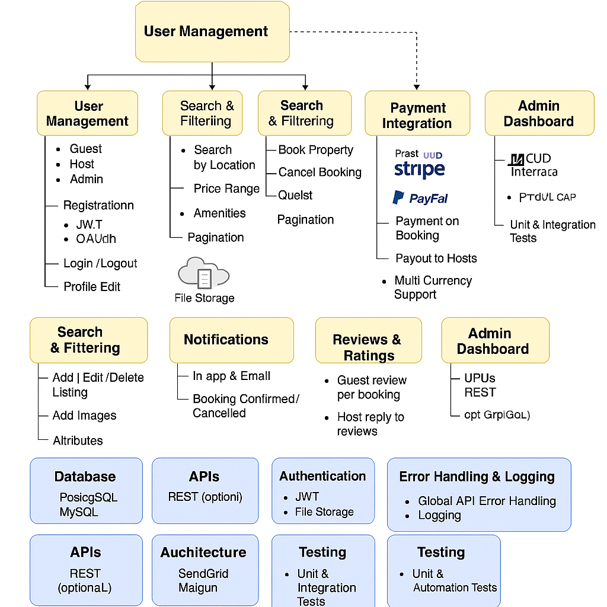

# 📘 Airbnb Clone Backend – Features & Functionalities

## 🎯 Objective
This document outlines the core backend features and technical requirements for building a scalable, secure, and efficient Airbnb Clone web application.

The diagram (`airbnb-backend-features.png`) provides a visual overview of the backend structure and interactions between components.

---

## 📊 Included Features (Diagram Highlights)

### 🔐 User Management
- Guest, Host, and Admin roles
- JWT-based authentication & OAuth (Google, Facebook)
- Profile management (photos, preferences)

### 🏠 Property Listings
- Add, edit, delete properties
- Include details: title, price, amenities, location, availability
- File upload for images

### 🔍 Search & Filter
- Filter by location, price range, amenities, number of guests
- Pagination for large datasets

### 📅 Booking System
- Book and cancel reservations
- Prevent double bookings
- Track booking status (pending, confirmed, canceled, completed)

### 💸 Payment Integration
- Stripe & PayPal integration
- Guest payment and host payouts
- Support for multiple currencies

### ⭐ Reviews & Ratings
- Guests leave reviews per booking
- Hosts can reply
- Review system tied to completed bookings

### 🔔 Notifications
- In-app and email notifications
- Booking confirmations, cancellations, payment updates

### 🛠️ Admin Dashboard
- Monitor/manage users, properties, bookings, payments
- Role-based access control

### 📚 Technical Stack
- **Database**: PostgreSQL or MySQL
- **API**: REST (optionally GraphQL)
- **Storage**: AWS S3 / Cloudinary (for images)
- **Email**: SendGrid or Mailgun
- **Auth**: JWT + RBAC
- **Caching**: Redis (for search optimization)
- **Testing**: Unit and integration tests (e.g., Pytest)
- **Error Logging**: Global API error handling & logging

---

## 📎 Diagram

---

