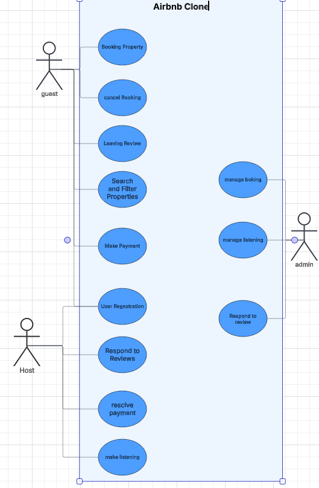

# 📘 Airbnb Clone Backend – Features & Functionalities

# Airbnb Clone - Use Case Diagram

## Objectives

 **Provide a Visual Representation**: To offer a visual diagram that reflects all of the system's major interactions and components, which aids in understanding the overall structure and flow of the platform.

---

## 📎 Diagram

---
